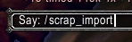
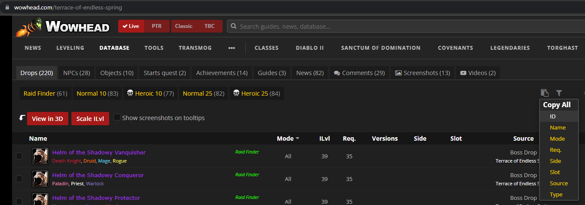
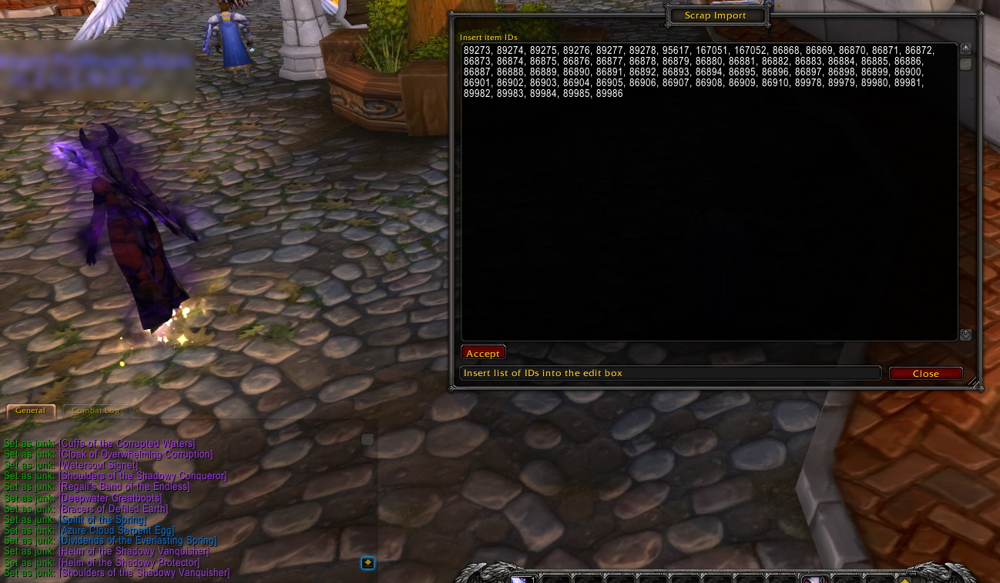

# Overview
Scrap Import is a World of Warcraft addon that allows to compose junk lists in few clicks. It uses [Scrap](https://github.com/Jaliborc/Scrap) addon API so needs to have installed both.

# Usage
+ Type /scrap_import in chat and press **Enter** to load GUI.

+ Open a list of items on Wowhead, for example, [Terrace of Endless Spring](https://www.wowhead.com/terrace-of-endless-spring), and copy item IDs.

+ Paste result into **Scrap Import** window and press **Accept**.

# Support
The best way to support is to subscribe to one of my social media accounts. It's free!
* [YouTube](https://www.youtube.com/channel/UC0GTvv-pGmdlY-W0SRC1q4g?sub_confirmation=1)
* [Twitch](https://www.twitch.tv/kagrayz)